# Training

## Percipio Badges Earned while at SAIC

| Date |  Title  | Image|
|------|--------|-------|
| October 28, 2025 | [Modern Data Management: Data Quality Management](https://skillsoft.digitalbadges.skillsoft.com/f6328e22-2e52-4214-b0da-d97b6df59e96#acc.iwTtbg8H)|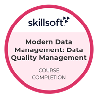|
| October 27, 2025 | [Introducing API Fundamentals & Testing: Understanding APIs](https://skillsoft.digitalbadges.skillsoft.com/7bb7c82f-0e36-4a1b-8105-fcb82612e053#acc.iCFYNTZQ)|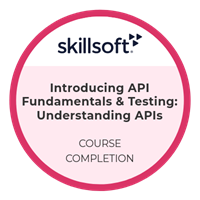|
| October 22, 2025 | [CompTIA A+ 220-1001: Storage Solutions](https://skillsoft.digitalbadges.skillsoft.com/898008c3-bc8a-470f-a8ba-62f34fbd6c11#acc.Dl8RzCr7)|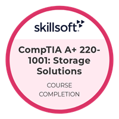|
| October 22, 2025 | [Modern Data Management: Data Governance](https://skillsoft.digitalbadges.skillsoft.com/c1ba98f8-612c-4231-8e42-6d6eeb812aa3#acc.ls1UGqMv)||
| October 21, 2025 | [Modern Data Management: Data Management Systems](https://skillsoft.digitalbadges.skillsoft.com/2e5a58d4-ad1b-4576-8241-6149d0dc8bbe#acc.B2Atfeha)|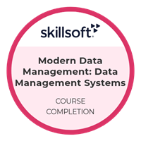|
| October 21, 2025 | [Data Nuts & Bolts: Fundamentals of Data](https://skillsoft.digitalbadges.skillsoft.com/a4d7ce9f-48b2-4733-a10a-d3b4a048fd40#acc.bM4gLWAm)|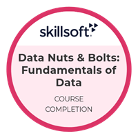|
| October 20, 2025 | [Deep Learning Fundamentals Aspire Journey Completion](https://skillsoft.digitalbadges.skillsoft.com/f7f1356d-3bf7-44d0-b3ce-546bd5b801ac#acc.3tHCqFge)| 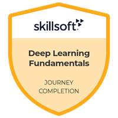|
| October 20, 2025 | [Track 5: Deep Learning Applications (Deep Learning Fundamentals Aspire Journey)](https://skillsoft.digitalbadges.skillsoft.com/2ae5e346-233b-40c7-9e94-9386349a6364#acc.RwIbjS4G)| 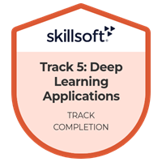|
| October 20, 2025 | [Track 4: Image Classification with Neural Networks (Deep Learning Fundamentals Aspire Journey)](https://skillsoft.digitalbadges.skillsoft.com/8e716c77-29f3-40b8-8a79-3d4571d6f073#acc.UfHQ2LKj)| 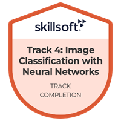|
| October 16, 2025 | [Track 3: Regression and Classification with Neural Networks (Deep Learning Fundamentals Aspire Journey)](https://skillsoft.digitalbadges.skillsoft.com/769a59cb-b3d0-4b6c-a6e2-fac1ef6ea8d4#acc.SMo9ynAL)| 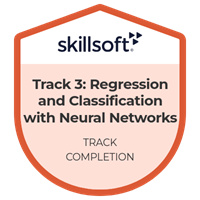|
| October 15, 2025 | [Track 2: Implementing Neural Networks in TensorFlow (Deep Learning Fundamentals Aspire Journey)](https://skillsoft.digitalbadges.skillsoft.com/5c623290-3f0a-4bec-b695-bc1351e15447#acc.khRcaKqi)| |
| October 14, 2025 | [Track 1: Deep Learning Foundations (Deep Learning Fundamentals Aspire Journey)](https://skillsoft.digitalbadges.skillsoft.com/63eedc3e-40f1-43e1-9289-8129da9fa550#acc.rKgWYfE7)| 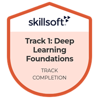|
| August 29, 2025 | [Web Apps with React and Redux Aspire Journey Completion](https://skillsoft.digitalbadges.skillsoft.com/a2c44549-f7c1-4e93-a17d-5311ad63e815#acc.cA0UFZnJ)| |
| August 29, 2025 | [Track 5: Advanced React (Web Apps with React and Redux Aspire Journey)](https://skillsoft.digitalbadges.skillsoft.com/eaa0af99-4d24-4aec-b288-e16546c45f61#acc.tUgABCN9)| 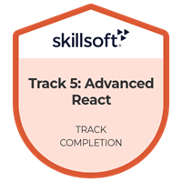|
| July 16, 2025 | [Track 4: Redux (Web Apps with React and Redux Aspire Journey)](https://skillsoft.digitalbadges.skillsoft.com/c0572a1e-3c1b-4ffe-809f-b36ab87ab346#acc.z4obPXSi)| 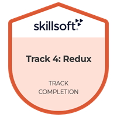|
| July 14, 2025 | [Track 3: Testing (Web Apps with React and Redux Aspire Journey)](https://skillsoft.digitalbadges.skillsoft.com/e7c9bfbb-ef66-4764-9aeb-23b62436f546#acc.DNdaxHPE)| 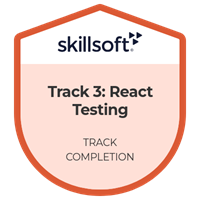|
| July 14, 2025 | [Track 2: React Router (Web Apps with React and Redux Aspire Journey)](https://skillsoft.digitalbadges.skillsoft.com/69da2314-af60-4801-8481-40961d08581e#acc.qJymtn4h)| 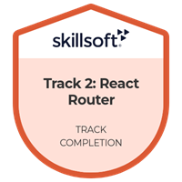|
| July 13, 2025 | [Track 1: React (Web Apps with React and Redux Aspire Journey)](https://skillsoft.digitalbadges.skillsoft.com/e07a74c2-f7d7-47e1-a074-28a4888dc503#acc.CINAgOtf)| 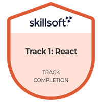|
| April 13, 2025 | [Python Development: Leveraging Functions with Lambdas, Generators, Closures, & Decorators](https://skillsoft.digitalbadges.skillsoft.com/5fa521c2-c79b-4e5f-b985-5faef9e41978#acc.YxcjpoQ8)| |
| April 13, 2025 | [Python Development: Leveraging Functions with Lambdas, Generators, Closures, & Decorators](https://skillsoft.digitalbadges.skillsoft.com/5fa521c2-c79b-4e5f-b985-5faef9e41978#acc.YxcjpoQ8)| |
| December 6, 2024 | [Building Data Pipelines (Apache Airflow)](https://skillsoft.digitalbadges.skillsoft.com/a7b59081-b146-4806-b2b0-9f80ebc90aea#acc.mvdQeMgr)| |
| July 8, 2024 | [Security Programming: Bash Scripting Essentials](https://skillsoft.digitalbadges.skillsoft.com/da55ccb4-f68b-4554-8c42-aa667784bb98#acc.FE6Cm3jx)| |
| October 11, 2023 | [DevOps for Engineering Leaders: Managing, Monitoring, & Securing the Pipeline](https://skillsoft.digitalbadges.skillsoft.com/29613399-85bc-49d1-9993-322431b694b0#acc.oqu4pjUK)| |
| October 5, 2023 | [Installation, Express-generator, & API](https://skillsoft.digitalbadges.skillsoft.com/ed3df995-29fe-4110-a111-a437e868d86f#acc.BlR6KHxp)| |
| September 29, 2023 | [Conditional Statements & Loops: If-else Control Structures in Python](https://skillsoft.digitalbadges.skillsoft.com/140a3105-4992-400b-9607-39dfdf70c964#acc.lTtpnYU5)| 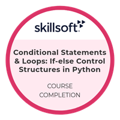|
| September 29, 2023 | [Complex Data Types in Python: Shallow & Deep Copies in Python](https://skillsoft.digitalbadges.skillsoft.com/80a4b690-9c67-4a9e-a035-32f6cf3ddcae#acc.qFAfQBst)| 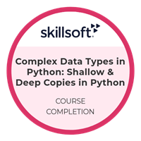|
| September 29, 2023 | [Complex Data Types in Python: Working with Dictionaries & Sets in Python](https://skillsoft.digitalbadges.skillsoft.com/e4b2a7a6-0685-4847-b2c4-c3dd612c2123#acc.jXrAmH8G)| 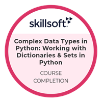|
| September 29, 2023 | [Complex Data Types in Python: Working with Lists & Tuples in Python](https://skillsoft.digitalbadges.skillsoft.com/858ad6eb-e3ad-4b63-99a6-531f0c305de7#acc.sx473X9i)| 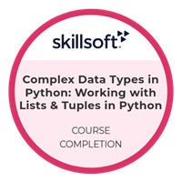|
| September 29, 2023 | [Getting Started with Python: Introduction](https://skillsoft.digitalbadges.skillsoft.com/f716e013-34f8-44ec-8ec5-3aee5523f1b4#acc.YDkoWa3t)| 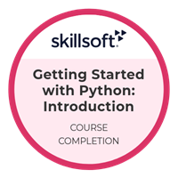|
| September 27, 2023 | [Developing Apps with Tkinter: Tree View Operations & Login and Sign-up Pages](https://skillsoft.digitalbadges.skillsoft.com/f07363f5-6d60-45aa-888c-2f4dd47bbe4e#acc.SEm5chXB)| |
| September 27, 2023 | [Developing Apps with Tkinter: Menu Bars, Seaborn Visualization, & MySQL DBs](https://skillsoft.digitalbadges.skillsoft.com/d361a876-afa0-46a5-a929-8daf3d1da403#acc.9N2Mu1se)| 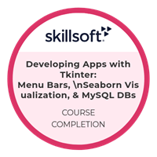|
| September 23, 2023 | [Developing Apps with Tkinter: Working with File Dialogs & Tree Views](https://skillsoft.digitalbadges.skillsoft.com/2f9811f9-d79d-46a0-ae9a-62138b14ce97#acc.5PTZqL8g)| 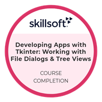|
| September 22, 2023 | [Developing Apps with Tkinter: Configuring Interactive Widgets](https://skillsoft.digitalbadges.skillsoft.com/4af5f32d-f76f-4e4a-b176-18b7e4c6649b#acc.dm2xgWB1)| |
| September 14, 2023 | [Developing Apps with Tkinter: Getting Started](https://skillsoft.digitalbadges.skillsoft.com/7df968c6-1875-4ae1-935b-7917d6a018b6#acc.PYda5hJf)| 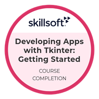|
| September 13, 2023 | [New Developments in Python](https://skillsoft.digitalbadges.skillsoft.com/cf30941f-2af3-443a-97bb-11771a5bb927#acc.lHM2Usch)| |
| August 24, 2023 | [Building and Migrating .NET Core Libraries](https://skillsoft.digitalbadges.skillsoft.com/64818149-a4ab-4f44-89a0-88f9d6f466f3#acc.R6vrDCgp)| 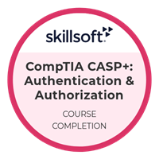|
| August 22, 2023 | [CompTIA CASP+: Authentication & Authorization](https://skillsoft.digitalbadges.skillsoft.com/64818149-a4ab-4f44-89a0-88f9d6f466f3#acc.R6vrDCgp)| |
| August 22, 2023 | [CompTIA CASP+: Storage & Network Security](https://skillsoft.digitalbadges.skillsoft.com/b9e61b95-7129-4b76-a84f-0b031560e52e#acc.JxtPrVlz)| 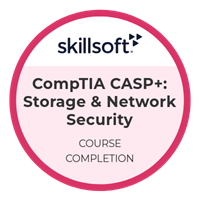|
| August 22, 2023 | [CompTIA CASP+: Vulnerabilities & Hardening](https://skillsoft.digitalbadges.skillsoft.com/e4b04e36-fdc1-498e-97f6-b8c2604a8ac7#acc.YpBGHWzu)| 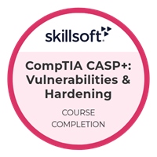|
| August 22, 2023 | [CompTIA CASP+: Secure Cloud Computing](https://skillsoft.digitalbadges.skillsoft.com/cd97ee40-ed2d-4313-8ae5-488e0e4445e4#acc.0skatuTU)| 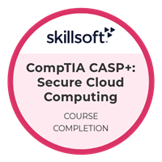|
| August 21, 2023 | [CompTIA CASP+: Virtualization Security](https://skillsoft.digitalbadges.skillsoft.com/dc83adbb-83d8-44a4-ae4b-4d77c0074fff#acc.4J9FjRuS)| 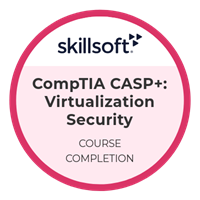|
| August 21, 2023 | [CompTIA CASP+: Assessing & Managing Risk](https://skillsoft.digitalbadges.skillsoft.com/3db12b28-9bb2-47c2-80da-30cde3d63f46#acc.zIsbEmtQ)| |
| August 15, 2023 | [Microsoft Azure Architect Design: Azure DevOps](https://skillsoft.digitalbadges.skillsoft.com/3b600357-154f-44b6-8867-630ce2d08724#acc.G2DwNShM)| |
| August 14, 2023 | [CCSP 2022: Cloud Computing Concepts & Reference Architectures](https://skillsoft.digitalbadges.skillsoft.com/d8d8b9b9-4811-4472-a8f7-76584b066b47#acc.WT5cFQxX)| 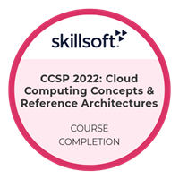|
| August 14, 2023 | [Microsoft Azure Architect Design: VNet Design & Implementation](https://skillsoft.digitalbadges.skillsoft.com/37bde150-dbb7-4bf9-b87c-f9a8a49051b1#acc.NA8oEQqi)| |
| August 11, 2023 | [CompTIA Security+: Analyzing Application & Network Attacks](https://skillsoft.digitalbadges.skillsoft.com/1e17c4d0-efbc-43a7-8d4c-0178dfc2fc38)| 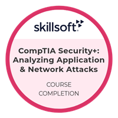|
| July 25, 2023 | [Vulnerability Assessment & Mitigation](https://skillsoft.digitalbadges.skillsoft.com/0de09c5c-9cd8-4b9b-bdf2-e265bddf760f#acc.98AMhxnp)| 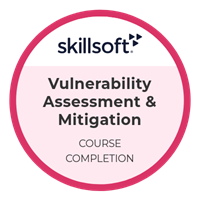|
| January 11, 2021 | [Defensive Programmer: Cryptography](https://skillsoft.digitalbadges.skillsoft.com/34e4284d-05b1-4956-ade6-b104b4eb8b43#acc.JlubfevM)| 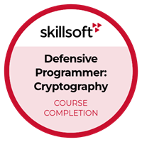|
| October 16, 2020 | [Software Security Best Practices](https://skillsoft.digitalbadges.skillsoft.com/7a23be58-e913-47dc-8d8c-c3a74c2b81a6#acc.oSlq9e0f)| |
| October 15, 2020 | [API Clean and Secure Coding: API Secure Coding](https://skillsoft.digitalbadges.skillsoft.com/15398963-3230-48ba-95d6-3173798191fb#acc.9GHNfi0x)| 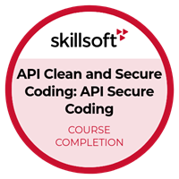|
| October 15, 2020 | [Cloud Security Administration: Cloud Data & Application Security](https://skillsoft.digitalbadges.skillsoft.com/8d54def3-1c46-4c34-8bd3-00d37bb9ccfc#acc.g2yaw0po)| |
| October 14, 2020 | [Cyber Security Audits](https://skillsoft.digitalbadges.skillsoft.com/d9a72bba-202a-4798-a3e9-4dbcf798b2a0#acc.RY35SbPy)| |
| October 13, 2020 | [Defensive Coding Fundamentals for C#](https://skillsoft.digitalbadges.skillsoft.com/0d25dc6c-21a5-4912-aff3-6abbb413166d#acc.bFMvO7s2)| 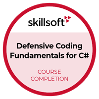|
| October 12, 2020 | [Cloud Security Management: Architecture Security](https://skillsoft.digitalbadges.skillsoft.com/81ca14b1-184a-44b2-a110-c709fc414b4e#acc.xEsv7C05)| |
| October 6, 2020 | [Securing .NET Programming](https://skillsoft.digitalbadges.skillsoft.com/06d6d37e-14b8-4cb7-8154-115cb64246e1#acc.36nBrV5I)| |
| October 5, 2020 | [SecOps Engineer: Security Engineering](https://skillsoft.digitalbadges.skillsoft.com/e30c8c1c-ad72-4e30-8a2f-1395bc4316fb#acc.Pe3yAiC0)| |
